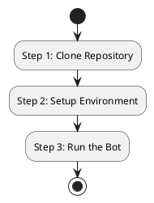

# User Guide and Onboarding for YouTube AI Money Bot 2026

## Introduction
Welcome to the **YouTube AI Money Bot 2026**! This bot is designed to automate and enhance your YouTube experience, paving the way for maximizing your earnings through strategic automation and data analysis. 

## Onboarding Steps
### Step 1: Clone the Repository
To get started, clone the repository to your local machine:
```bash
git clone https://github.com/Dmitze/YTAIMBot.git
```

### Step 2: Environment Setup
To set up the environment, you will need the following dependencies:
- **Python 3.x**
- **Required packages**: Install these via pip:
```bash
pip install -r requirements.txt
```
Make sure to configure your environment variables as needed.

## FAQ
### Q1: What does this bot do?
The YouTube AI Money Bot automates...

### Q2: How do I contribute to this project?
You can contribute by...

## Math Integration
### Recursion Theme 3 
Implementing recursion in bot logic...

#### Example Configurations
```yaml
# Add your configuration examples here
```

## Run Steps
To run the bot, simply execute:
```bash
python main.py
```
Make sure that your environment is properly set up before running.

## Risks and Fixes
- Risk 1: Description...
  - Fix: Suggested solutions...

## Setup Flowchart
Use the following PlantUML code to create your setup flowchart:


## Tests
Conduct manual tests by following these steps:
1. Step 1...
2. Step 2...

## Config.yaml Template
Below is a template for the `config.yaml`:
```yaml
# Provide your configuration settings here
```

## Motivational Note
> Remember, every big achievement starts with the decision to try. Keep pushing forward!