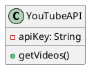

# Architecture Diagrams and Visualizations Guide for YouTube AI Money Bot 2026

## Introduction
This document provides a comprehensive guide to the architecture and visualizations for the YouTube AI Money Bot (YTAIMBot) developed in 2026. The bot leverages advanced algorithms to analyze trends and automate the process of earning revenue from YouTube content.

## UML Class Diagram for Agents
The following UML class diagram represents the key agents involved in the YTAIMBot system:

```plaintext
+------------------+       +-----------------+
|    YouTubeAPI    |<>-----|   AnalyticsAgent  |
+------------------+       +-----------------+
| - apiKey: String |       | - analyzeData() | 
| + getVideos()    |       | + getInsights()  |
+------------------+       +-----------------+
                                  /
                                 /  
+------------------+        +------------------+
|   UserAgent      |<>------+   NotificationAgent|
+------------------+        +------------------+
| - userId: String |        | - notifyUser()   |
| + getUserInfo()  |        | + sendAlert()    |
+------------------+        +------------------+

```

## Flowchart for Bot Cycle
Below is the flowchart representing the cycle of operations for the YTAIMBot:

```plaintext
[Start] --> [Fetch Data] --> [Analyze Data] --> [Generate Reports] --> [Notify User] --> [End] 
```

## Trend Graph Visualization with NetworkX and Matplotlib
The following Python code can be used to visualize trends using NetworkX and Matplotlib:

```python
import networkx as nx
import matplotlib.pyplot as plt

# Create a graph
G = nx.Graph()

# Add nodes and edges
G.add_edges_from([(1, 2), (1, 3), (2, 3)])

# Draw the graph
nx.draw(G, with_labels=True)
plt.title('Trend Graph Visualization')
plt.show()
```

## draw.io Generation Steps
1. Open draw.io.
2. Choose a diagram type that fits your needs (flowchart, UML, etc.).
3. Use the available shapes and connectors to build your diagram.
4. Save and export your diagram as needed.

## Risks & Fixes
- **Risk:** Data privacy issues due to unauthorized access to user data.
  - **Fix:** Implement strict authentication protocols.
- **Risk:** System failures due to unexpected errors in data processing.
  - **Fix:** Incorporate comprehensive error handling and logging.

## PlantUML Examples


## Visual Review Test Checklist
- [ ] Validate UML diagrams for accuracy.
- [ ] Confirm flowchart logic correctness.
- [ ] Test trend graph visualizations for expected output.
- [ ] Review draw.io diagrams for completeness.
- [ ] Ensure risks and fixes are adequately addressed.