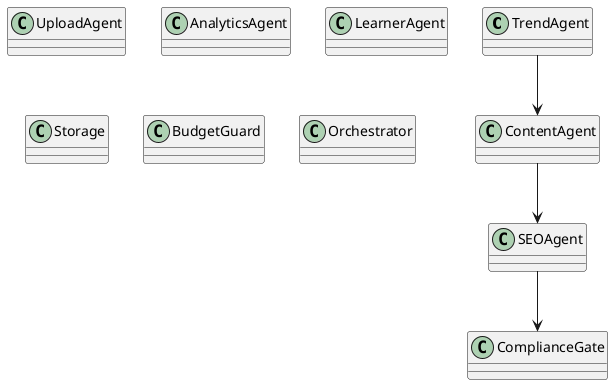
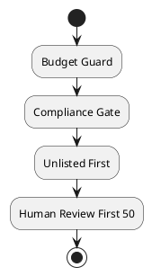
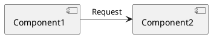
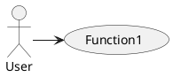

# Візуали

В цьому документі представлено інформацію про візуали, які використовуються в проекті.

## Діаграма класів PlantUML для агентів


## Діаграма потоку PlantUML для циклу бота


## Код для візуалізації графіка трендів з NetworkX + matplotlib
```python
import matplotlib.pyplot as plt
import networkx as nx

G = nx.Graph()
G.add_edges_from([(1, 2), (1, 3), (2, 4)])

pos = nx.spring_layout(G)
nx.draw(G, pos, with_labels=True)
plt.show()
```

## Кроки у draw.io та альтернативна кодова реалізація
1. Імплементуйте блоки в draw.io.
2. Використовуйте відповідні шablони з draw.io.

## Ризики та рішення
- Ризик: Неправильна реалізація логіки.
- Виправлення: Ретельне тестування та перевірка.

## Фрагменти PlantUML




## Перевірочний список візуалізації тестів
- [ ] Чи відповідає візуал даним?
- [ ] Чи відповідають тести проекту?

## Таблиця покриття
| Функція          | Покриття |
|------------------|----------|
| Function1        | 80%      |
| Function2        | 75%      |