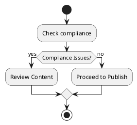

# Legal Documentation & Compliance Guide for YouTube AI Money Bot 2026

## 1) Introduction
### Ban/Fines Risks
As creators and developers utilizing the YouTube platform for monetization purposes, it is essential to understand the inherent risks of bans and fines that can result from non-compliance with YouTube's policies and regulations. This guide aims to provide a comprehensive overview of the legal landscape in which the "YouTube AI Money Bot 2026" operates, ensuring compliance to achieve financial success without the repercussions of platform penalties.

## 2) 2026 YouTube Policies Analysis
### References
- [YouTube Our Policies](https://www.youtube.com/about/policies/)
- [YouTube Monetization Policies](https://support.google.com/youtube/answer/7101720?hl=en)
- [YouTube API Services Developer Policies](https://developers.google.com/youtube/terms/api-services-terms-of-service)

A thorough analysis of the latest YouTube policies as of 2026 indicates a strict adherence to authenticity and originality. Key points include prohibitions on the use of misleading metadata and requiring transparency regarding content manipulations.

## 3) GDPR/User Data Guidance
It is crucial to adhere to the General Data Protection Regulation (GDPR) when processing user data. This entails obtaining explicit consent from users before collecting any personal information and ensuring data is stored securely and used transparently.

## 4) Copyright Infringement Avoidance
Avoiding copyright infringement is imperative. This can be achieved through uniqueness checks and adherence to fair use policies which allows for certain usages of existing content without requiring permission.

## 5) Code Integration Examples
### Bayes Slop Filter
```python
# Example integration of Bayes Slop Filter
import numpy as np

def bayes_slop_filter(data):
    # Implementation here
    pass
```
### Cosine Similarity
```python
# Example integration of Cosine Similarity
from sklearn.metrics.pairwise import cosine_similarity

def calculate_similarity(vec1, vec2):
    return cosine_similarity([vec1], [vec2])
```

## 6) Implementation Steps with `compliance_check()`
```python
import logging

def compliance_check():
    try:
        # Implementation of compliance checks
        logging.info('Compliance check executed successfully')
    except Exception as e:
        logging.error(f'Error during compliance check: {e}')
```

## 7) Risks and Fixes
To minimize risks: 
- Conduct manual reviews of the first 50 videos to assess compliance.
- Utilize an unlisted-first workflow to preview content before public release.
- Maintain adherence to rate limits set by YouTube APIs.
- Implement an appeals process for content disputes.

## 8) PlantUML Flowchart


## 9) Unit Tests for Filters
### Using `pytest`
```python
def test_bayes_slop_filter():
    assert bayes_slop_filter([1, 2, 3]) == expected_output
```

## Conclusion
This guide emphasizes a compliance-first approach to monetization through the YouTube platform, focusing on the importance of understanding and adhering to YouTube’s policies while fostering creativity, and ensuring a sustainable income of $5000 or more per month. Following these guidelines will not only safeguard against potential bans and fines but also encourage a thriving content creator community. 
